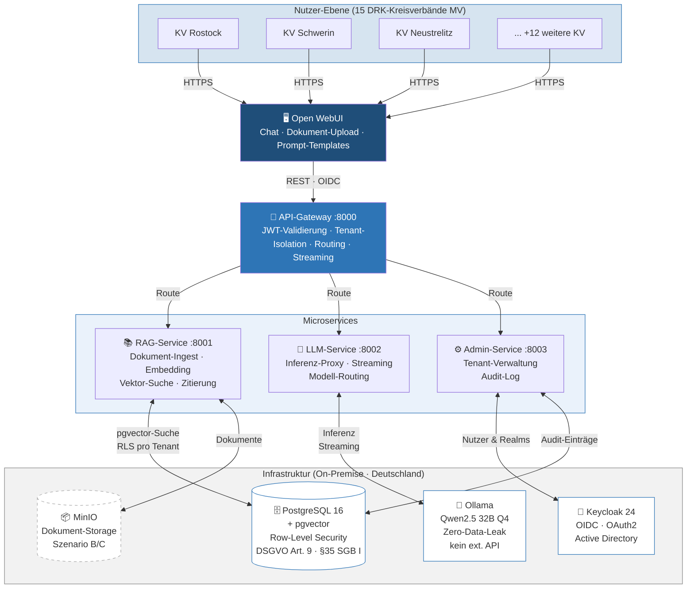

# Architektur-Übersicht — DRK MV KI-Plattform

> Wird auf GitHub automatisch als Diagramm gerendert.

## Compliance-Hinweise

| Anforderung | Umsetzung |
|---|---|
| DSGVO Art. 9 / § 35 SGB I | PostgreSQL RLS — `tenant_id` in jeder Zeile, kein cross-tenant Zugriff möglich |
| Zero-Data-Leak | Alle LLMs und Embeddings laufen lokal in Ollama — kein externer API-Aufruf |
| Kein Prompt-Logging | LLM-Service loggt keine Nachrichteninhalte, nur Metadaten (tenant_id, Modell) |
| Audit-Log | Admin-Service protokolliert nur administrative Aktionen (Rechtevergabe, Tenant-Änderungen) |
| Mandantentrennung Auth | `tenant_id` kommt ausschließlich aus validierten JWT-Claims (Keycloak) |
